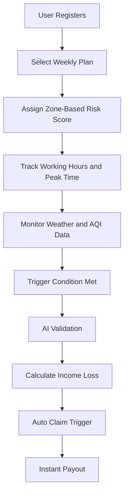

# Smart Zone-Based Income Protection for Delivery Riders

---

## 🚨 1. Problem Statement

**Delivery partners** working for platforms like **Swiggy and Zomato** depend on daily deliveries for income.  

External disruptions such as **heavy rain, extreme heat, and high pollution** reduce their working hours and result in **direct income loss**.  

Currently, there is **no system** that compensates them for this loss, making their earnings unstable.

---

## 👤 2. Persona

Our target persona is a **Swiggy delivery partner** who earns based on daily deliveries and works mainly during **peak hours**.  

Their income is directly affected by **external environmental conditions** such as rain, heat, and pollution, which reduce their ability to work and lead to **financial instability**.

---

## 💡 3. Proposed Solution

We propose a **Smart Zone-Based AI-powered parametric insurance platform** that provides income protection to delivery partners.  

The system:
- Automatically detects **external disruptions**  
- Calculates **income loss based on time and severity**  
- Provides **instant compensation without manual claims**  

Unlike traditional models, it adapts to:
- 📍 Location risk  
- ⏰ Peak earning hours  
- 🌦️ Disruption intensity  

---

## ⚙️ 4. Workflow

1. User registers on the platform  
2. Selects a **weekly insurance plan**  
3. System assigns a **risk score based on location (zone-based)**  
4. Tracks **working hours and peak earning periods**  
5. Monitors **real-time environmental conditions (weather, AQI)**  

6. If disruption occurs:
   - ✅ Validates rider **activity and GPS location**  
   - 📊 Calculates **income loss based on duration and severity**  

7. 💸 Automatically triggers **claim and payout**

---

## 💰 5. Weekly Pricing Model

The premium is structured on a **weekly basis** and dynamically adjusted:

- 🟢 Low-risk zone → ₹40/week → Coverage ₹400  
- 🟡 Medium-risk zone → ₹60/week → Coverage ₹600  
- 🔴 High-risk zone → ₹80/week → Coverage ₹800  

Pricing depends on:
- Location risk  
- Historical disruption data  
- Rider activity patterns  

---

## 🌦️ 6. Parametric Triggers

Payouts are automatically triggered when conditions exceed thresholds:

- 🌧️ Rainfall > 50mm for more than 2 hours  
- 🌡️ Temperature > 42°C during peak hours  
- 🌫️ AQI > 300 for sustained duration  

👉 Payout is proportional to **duration + severity of disruption**

---

## 🤖 7. AI Integration

AI is used to enhance system intelligence:

- 📊 Risk Assessment → Based on location and history  
- 💰 Dynamic Pricing → Adjusts weekly premium  
- 🔐 Fraud Detection:
  - GPS/location validation  
  - Rider activity verification  
  - Duplicate claim detection  

---

## 🛠️ 8. Tech Stack

- Frontend: ReactJS  
- Backend: Spring Boot  
- Database: MySQL  
- APIs: Weather API (or mock APIs)

---

## 🚀 9. Future Scope

- Integration with real payment systems (UPI, Razorpay)  
- Advanced machine learning models  
- Expansion to other gig economy platforms  

---

## 🔄 System Flow Diagram

